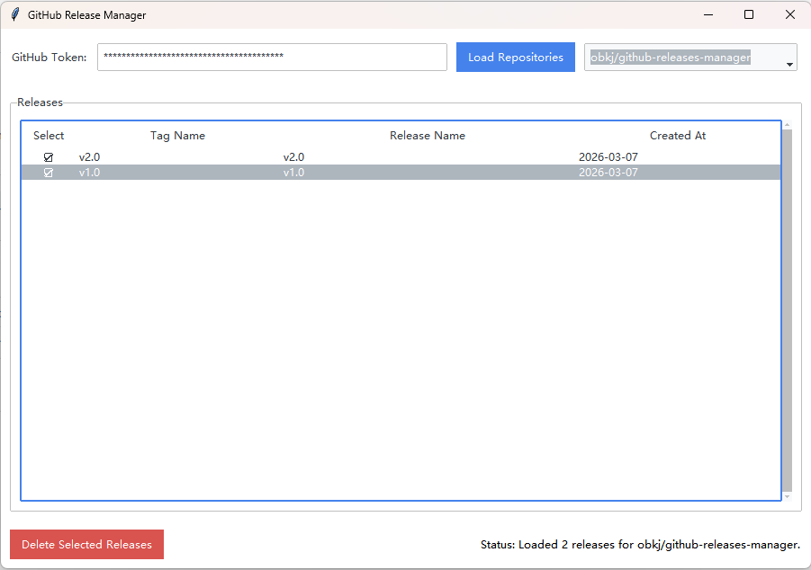

# GitHub Release Manager



---

一个使用 Python 和 Tkinter (ttkbootstrap) 构建的图形化 GitHub Release 管理工具，支持浏览和批量删除 Releases。

## ✨ 功能特性

- **Token 验证**: 只需输入一次 Personal Access Token 即可加载所有仓库。
- **仓库浏览器**: 自动获取并以列表形式展示用户有权访问的所有仓库。
- **Releases 列表**: 清晰地展示选定仓库的所有 Releases，包含 Tag、名称和创建日期。
- **批量删除**: 支持通过复选框选择多个 Releases，并一键执行批量删除操作。
- **美观的界面**: 使用 `ttkbootstrap` 提供了现代、简洁的用户界面。
- **跨平台**: 基于 Python 和 Tkinter，理论上可在 Windows, macOS 和 Linux 上运行。

## 🛠️ 安装与环境准备

1.  **克隆仓库**
    ```bash
    git clone https://github.com/obkj/github-releases-manager
    cd github-releases-manager
    ```

2.  **安装 Python**
    请确保您的电脑上已安装 Python 3.8 或更高版本。

3.  **安装依赖**
    项目的所有依赖项都记录在 `requirements.txt` 文件中。打开命令行工具，运行以下命令进行安装：
    ```bash
    pip install -r requirements.txt
    ```

## 🚀 如何运行

直接运行主程序脚本即可启动应用：

```bash
python main.py
```

## 📦 打包为可执行文件 (Windows)

项目内提供了一个 `build.bat` 批处理脚本，可以方便地将应用打包成一个独立的 `.exe` 文件，无需 Python 环境即可运行。

1.  确保所有依赖已安装 (特别是 `PyInstaller`)。
2.  双击运行 `build.bat` 脚本。
3.  等待脚本执行完毕。
4.  打包成功后，可在生成的 `dist` 文件夹内找到 `GitHubReleaseManager.exe` 文件。

## 📝 使用说明

1.  在顶部的输入框中填入您的 GitHub Personal Access Token。
2.  点击 "Load Repositories" 按钮，右侧的下拉列表将加载您的所有仓库。
3.  从下拉列表中选择一个仓库，下方的表格将自动加载该仓库的所有 Releases。
4.  点击表格第一列 "Select" 下的方框来勾选需要删除的 Releases。
5.  点击左下角的 "Delete Selected Releases" 按钮，在弹出的确认框中确认后即可删除。